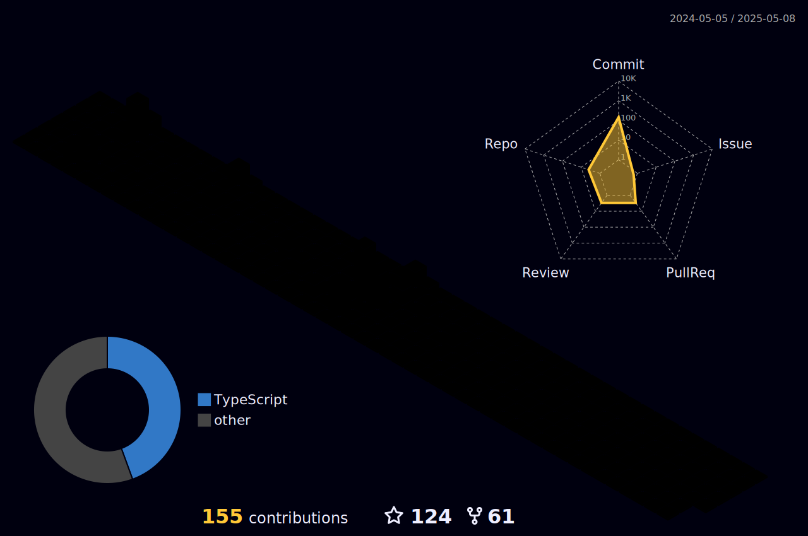

# Welcome to my profile

- :office_worker: Full Stack Developer of Web and Mobile applications in the maintenance area with thousands of users whose objective is to facilitate the organization of maintenance routines within **ExxonMobil** sites.

# Responsibility:
- Developed front-end, back-end, and mobile applications using best practices in software development.
- Ensured the smooth operation and continuous support of the applications, proactively addressing any issues and providing timely resolutions to maintain optimal performance.
- Collaborated within a team to find optimal solutions for day-to-day challenges.
- Conducted testing and debugging to ensure the quality of the final product.
- Explored innovative solutions compatible with the technologies and work environment.

  
  |  |  
 | ----------- | ----------- |

  <h1>Technologies</h1>
  <a href="https://skillicons.dev"   >
    
  </a >

  <h1>Contacts</h1>
  
  

  

    <h1>Status</h1>
    
  

 
